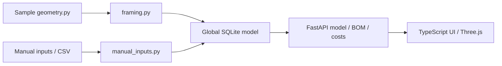

# TimberBIM Lite improvement and expert handover plan

Assessment date: **2026-10-09, Asia/Manila**. Source baseline: Git commit **28c1b6b**.

This plan follows an inspection of the source, README, feature report, sample CSVs, database schema, API behavior, and desktop/mobile UI. It records confirmed defects separately from recommendations. It is an implementation and handover guide; the investigation did not certify structural design or the accuracy of the NZS tables.

**Original priority:** protect project persistence and CSV validation/preview,
then correct wall/truss geometry. These foundations now have implemented regression
coverage. **Current resume point:** use section 9, starting with Imports/API resource-bound
coverage, measured estimating-read work and fabrication/template documentation. It records remaining
domain-review gates separately from verified implementation.

## 1. Requirements and decision boundaries

1. **Stability comes first.** Feature restrictions, removal of supported options, replacement of frameworks, and migrations to a different database require the project owner's explicit confirmation before implementation. The decision register below contains proposals, not approvals.
2. **Other home designs must remain possible.** The existing house should become a sample project using the same project schema and generators as other designs. Editing Python constants must not be the normal way to create a house.
3. **Roof trusses must include webs.** Model and validate chords, webs, their connections, bearing locations, and repeated instances. A successful preview must not imply that a disconnected or incomplete layout is a complete truss.
4. **UI improvements are welcome.** Prioritize a visible model, clear project state, useful selection, reliable previews, accessible forms, and readable estimating tables.

The original assessment added documentation only. Implementation is now underway;
section 9 records completed work, remaining gates, and the next resume point.
No feature restriction or framework replacement has been approved or performed.

## 2. Where the next expert should start or resume

At assessment there was **one browser page at `/`**, with seven sidebar panels; there is no page router. “Page” below means a workspace panel or the 3D workspace. Open the sidebar by hovering/focusing its rail and pin it on a desktop. Panel deep links are now available; the table maps starting pages and source files. Section 9 gives the verified implementation state.

| Page / panel | Start here when… | First source files and functions | Resume checkpoint |
|---|---|---|---|
| **Settings / Warnings** | Investigating lost data, reset, regeneration, or another browser changing the model | [sidebar.ts](frontend/src/sidebar.ts), [server.py](backend/server.py) project endpoints, [db.py](backend/db.py) `rebuild`, `model_json`, `ensure_model`; [schema.sql](backend/schema.sql) | **S1** is verified. Preserve rollback/read-only isolation tests; continue **S2** compatibility/definition coverage and **R1** qualified review. Inspect revision-safe regeneration before changing persistence. |
| **Imports / Drawing Plans** | Reusing the app for another house or reproducing the failing bundled example | [imports.ts](frontend/src/imports.ts), [csv_plan.py](backend/imports/csv_plan.py), [validators.py](backend/imports/validators.py), [schemas.py](backend/imports/schemas.py), CSV endpoints in [server.py](backend/server.py) | Examples and independent saved homes now pass end-to-end checks. Resume **V1** resource-bound/contract coverage, **W1** fabrication details and **D1/T2** roof/floor domain gates. |
| **Manual Wall Frame Input** | Fixing openings, studs, nogs, lintels, panel limits, or differing generated/manual behavior | [manualInputs.ts](frontend/src/manualInputs.ts) `ManualWallPanel`, [formGuidance.ts](frontend/src/formGuidance.ts), [drafts.ts](frontend/src/drafts.ts), [manual_inputs.py](backend/manual_inputs.py) `ManualWallFrameInput`, [walls.py](backend/walls.py) | Guided fields/errors/raw drafts are implemented; complete **W1** fabrication details and qualified panel/connection review. Preserve U2 keyboard/recovery contracts. |
| **Manual Truss Input** | Addressing the requested webs, topology, repeated layouts, or specialized truss types | [manualInputs.ts](frontend/src/manualInputs.ts) `ManualTrussPanel`, [formGuidance.ts](frontend/src/formGuidance.ts), [manual_inputs.py](backend/manual_inputs.py) `ManualTrussInput`, [trusses.py](backend/trusses.py), [review.py](backend/review.py) | Connected templates/unique instances and corrected automatic bearings exist; continue **T1/T2/R1** supplier, support and qualified-design gates. Preserve custom CSV field/error contracts. |
| **Building Specs** | Changing storeys, roof, exposure, material/spacing/ply scopes, or inspecting a selected frame | [ui.ts](frontend/src/ui.ts), [main.ts](frontend/src/main.ts), [types.ts](frontend/src/types.ts), [geometry.py](backend/geometry.py), [framing.py](backend/framing.py) `ModelConfig`, `generate` | Saved home/configuration and **U1** view/filter/revision contracts are implemented. The seven-page local **U2** assessment passes; continue device/assistive review and **R1** source-assumption review; preserve current ranges and options. |
| **3D workspace** | Fixing navigation, models outside the camera, layers, selection, roof visibility, or performance | [workspaceState.ts](frontend/src/workspaceState.ts), [workspaceTools.ts](frontend/src/workspaceTools.ts), [modelHierarchy.ts](frontend/src/modelHierarchy.ts), [memberGeometry.ts](frontend/src/memberGeometry.ts), [scene.ts](frontend/src/scene.ts) `Viewer`, [main.ts](frontend/src/main.ts) `render`, `showPreview`; [styles.css](frontend/src/styles.css) | Continue **U2/M1** from the view-state/orthographic/section/dimension milestone: hierarchy/BOM/keyboard navigation is verified, including 260-instance paging and mobile canvas space. Rendering now pauses when settled and preserves active rotation/damping; the seven-page local accessibility assessment now passes. Resume physical-device/enlarged-text/assistive review and API/resource profiling. |
| **BOM** | Checking quantities, stock lengths, procurement meaning, exported totals, or estimate reconciliation | [bomPanel.ts](frontend/src/bomPanel.ts), [bom_queries.py](backend/bom_queries.py) shared physical/BOM SQL, [db.py](backend/db.py) `bom_json`, `bom_csv`, `cost_summary` | Physical quantities, upward stock rounding and exact saved-assembly/row navigation are implemented. Continue **E1** supplier/stock/splice/replay workflows; preserve JSON/CSV revision and pricing contracts. |
| **Pricing** | Fixing ineffective overrides, confidence, unsupported sizes, treatment pricing, FX, or stale price snapshots | [pricingPanel.ts](frontend/src/pricingPanel.ts), [materials.py](backend/materials.py), [db.py](backend/db.py) `_price`; pricing API in [server.py](backend/server.py) | Override propagation, unknown-price coverage and save/reopen pass checks. Resume **E1** supplier/currency/stock workflows and cross-version price replay; retain existing dated provenance. |

Suggested reading order: this plan → [README.md](README.md) for operating instructions → [REPORT.md](REPORT.md) for feature history → the files for the selected ticket. Treat historic verification in REPORT as background; use the current assessment below for the present baseline.

## 3. Original architecture and useful foundations

| Area | Implementation at original assessment | Foundation worth retaining |
|---|---|---|
| UI | Strict TypeScript, direct DOM rendering, Vite, Three.js; most CSS is inline in `frontend/index.html` | Small dependency surface; typed frontend contracts; working production build. |
| Rendering | Instanced boxes grouped by member type; OrbitControls; group selection by `segment_id` or `truss_id` | Efficient representation for the sample; source coloring and member metadata already exist. |
| API | FastAPI; generated-model queries, CSV validation/preview/commit, manual wall/truss endpoints | Preview and commit endpoints are already separated. |
| Generation | `framing.py` for the built-in house; `manual_inputs.py` for manual/CSV geometry | Material/spacing/ply precedence and source tracking are useful existing capabilities. |
| Persistence | One SQLite file, `backend/model.db`; elements, model metadata, import batches, SQL BOM view | SQL aggregation, temporary test databases, and batch provenance can be extended without a database replacement. |
| Estimating | Material catalogue, source/date/confidence metadata, USD cost summaries and CSV | Provenance is present; the problem is consistent application and accurate interpretation. |
| Tests | 20 backend smoke tests; frontend type checking and build | Existing tests isolate the development database through a fixture. |

The built-in footprint, walls, support lines, roof rectangles, porch, and slabs are declared in [geometry.py](backend/geometry.py). `generate()` imports these directly. `_Roof` receives rectangles in feet, whereas manual/CSV inputs use millimetres. Level elevations, member sizes, and generated roof pitch also depend on constants in `nzs3604.py`.



The two generation paths and global model state are the main architectural seams to address.

## 4. Verification performed for this assessment

Backend dependencies were installed from `backend/requirements.txt` into an isolated temporary environment. Frontend dependencies were installed using the committed lockfile. Runtime probes and browser checks used temporary SQLite files; no development `backend/model.db` was created or modified.

| Check | Result |
|---|---|
| Python / Node used | Python **3.12.3**, Node **24.16.0**, npm **11.13.0**. These are observed versions, not a proposed support policy. |
| Backend smoke suite | **20 passed**: `python -m pytest test_smoke.py -q` from `backend/`. |
| Frontend build | **Passed**: `npm run build` performs TypeScript checking and Vite production build. Vite **6.4.3**; generated JS about **558 kB**, about **142 kB gzip**. Bundle size alone is not a measured performance defect. |
| Default generated house | **1,163 elements**, **25 wall segments**, **0 truss members**. Its roofs use rafters/ridges/gable framing. |
| Browser inspection | Headless Chromium inspected the desktop workspace and a **390 × 844** mobile viewport; pricing override and malformed-storage behavior were exercised. |
| Structural/standards review | Source assumptions were inspected. No load analysis, supplier certification, full standards audit, or construction approval was performed. |

### Confirmed defects and targeted reproductions

This table records the original assessment evidence. Some findings are now fixed;
use the implementation tracker in section 9 for current status and verification.

“Reproduced” means an API, generator, SQL, or browser probe was actually run. “Source finding” means the issue follows from inspected code and still needs a dedicated regression test or visual check.

| Finding | Evidence / reproduction | Status | Ticket |
|---|---|---|---|
| Rebuild failure destroys the previous model | Seed 1,163 elements; inject a generated element with `length_mm=0`; call `rebuild`. The insert raises `IntegrityError`, leaving **0 elements and 0 metadata rows**. `executescript(SCHEMA)` has already dropped/recreated the tables. | Reproduced with failure injection | S1 |
| Clients share one mutable model | Client A loads `storeys=2`; client B loads defaults; A's cost endpoint changes from **$19,521.89 to $10,504.24** and the database configuration becomes one storey. | Reproduced with two ASGI clients | S2 |
| CSV-only project later regains the sample | Commit a valid 3.6 m wall with `new_project_from_csv`: generated count is 0. Read `/api/model?roof=hip`: **1,157 generated members return**, alongside 16 imported members. | Reproduced | S2 / D1 |
| Replacement retains stale sample metadata | After replacing with one imported wall, `meta.frame_segments` still contains the sample's **25 segments**. | Reproduced | S2 / D1 |
| Bundled CSV passes validation but fails preview | Upload [walls_openings_trusses.csv](examples/walls_openings_trusses.csv): `can_preview=true`, zero validation errors; preview returns **500**. Its 9 m and 7 m walls exceed the manual wall envelope used during conversion. | Reproduced | V1 / W1 |
| Other validation/preview disagreements | CSV wall `treatment=H9` passes CSV validation but preview returns **500**. An opening with valid `center_offset_mm` and blank `start_offset_mm` also returns **500**. | Reproduced | V1 |
| Empty replacement is accepted | POST CSV commit with `rows=[]`, `mode=replace_sample_geometry`: **200**, leaving the model empty. The API does not enforce `can_preview`. | Reproduced | V1 / S2 |
| Repeated commit duplicates members | Append the same 16-member manual wall twice with the same source/input ID: **16 → 32 members**. Batch metadata uses replacement while elements are appended. | Reproduced | S2 / U1 |
| Nog enters a window opening | A 3.6 m manual wall with window offset 1.2 m, width 1.2 m, sill 0.9 m, head 2.1 m emits a nog centered at **(1.8 m, 1.245 m elevation)** inside the opening. | Reproduced | W1 |
| Wall validation accepts conflicting geometry | Two identical overlapping openings are accepted. `top_plate_size=-90x45` produces negative plate widths. | Reproduced | W1 |
| Custom trusses can omit webs | Three custom nodes and two top chords plus one bottom chord preview successfully with **no web members**. The form's initial custom example is also chord-only. | Reproduced / source finding | T1 |
| Zero-length truss previews successfully | Two custom nodes at identical coordinates produce a **200 preview with length 0**, followed by **500 on commit** due to the SQLite constraint. | Reproduced | T1 / V1 |
| Repeated trusses share an identity | Quantity 2 with `truss_id=AUDIT-T` produces 14 members with one shared truss ID. Picking currently groups the entire layout. | Reproduced / source finding | T1 / U1 |
| Named truss types are incomplete | Attic geometry is identical to common geometry. Girder generation changes every member's type to `truss_girder`, losing chord/web roles. Scissor generation places bottom-chord pieces on the same BL–C and C–BR paths used by other members. | Reproduced for attic/girder; scissor source finding | T1 |
| Standard truss nodes do not align with chords | For the default 9 m span, 25° pitch, 450 mm overhang: BL node local height is 0, but top chord height there is **190.76 mm**; Q1 is **95.38 mm** below its top chord. The named `king_post` runs diagonally from BL to C. | Reproduced by coordinate calculation from generator | T1 |
| Price overrides have no estimating effect | In Pricing, set SG8 to **$99/lm**. Storage contains the override, but the model cost remains **$10,504.24**. No path applies it to backend/BOM pricing. | Reproduced in browser / source finding | E1 |
| Unsupported sizes silently use default pricing | `unit_price_usd_per_lm('sg10','240x90')` returns the same **$4.13/lm, high confidence** as `90x45`. | Reproduced | E1 |
| Fractional cut lengths round stock downward | The BOM expression gives **3,000 mm stock for a 3,000.1 mm cut** because it truncates the cut before rounding. | Reproduced in SQLite | E1 |
| Pinned mobile sidebar hides the model | At 390 px width, pinned sidebar is **410 px**; viewport and canvas both measure **0 px wide**. | Reproduced in browser | U2 |
| Corrupted saved prices interrupt startup | Set `timberbim.priceOverrides` to `{bad` and reload: uncaught `SyntaxError`; Building Specs/stats never initialize. | Reproduced in browser | U1 |
| View preferences are lost on rebuild | `buildModel()` recreates visible meshes; category visibility is not retained. `Panel.renderLayers()` recreates checked toggles. Selection is reset, and source-filter changes can leave inspector state stale. | Source finding | U1 |
| Imported strings reach raw HTML | Labels/materials/notes/warnings are interpolated into `innerHTML` in selection, warnings, and manual-result rendering; escaping exists in some other panels but is inconsistent. | Source finding; no exploit executed | V2 |

Passing smoke tests therefore establishes a useful baseline, but does not cover the failure cases above.

## 5. Prioritized implementation backlog

Problem statements below describe the original baseline; section 9 supersedes them for fixed issues.

Priority meanings: **P0** protects project data and model identity; **P1** corrects essential modeling/estimating workflows; **P2** improves usability, maintainability, and larger-model behavior. “Done when” is an acceptance gate for handover.

### S1 — Preserve data across regeneration and schema changes · P0

Start: Settings / Warnings. Owner: backend/persistence expert. Files: `db.py`, `schema.sql`, project endpoints in `server.py`. Dependency: none.

`rebuild()` currently uses a destructive schema script during normal regeneration. Wrapping `executescript` in the current connection context did not preserve the previous database in the failure probe. It also catches errors while reading old additions and can continue with an empty preservation list.

Actions:

- Introduce an explicit schema version and forward migrations. Reserve table-dropping SQL for deliberate test/bootstrap use, with a separate path from ordinary regeneration.
- Validate new geometry before persistence. Replace the relevant project's generated members and metadata atomically, leaving preserved additions and source definitions intact.
- Use a verified transactional approach for the selected SQLite/Python setup. A staging revision is an option; test the actual rollback behavior rather than assuming the context manager provides it.
- Report preservation/migration failures; do not silently treat unreadable additions as absent.
- Make database location configurable. Document backup/restore and add a health/readiness endpoint that checks schema compatibility without rebuilding the user's model.

Done when: injected generation/insert/migration failure leaves the previous elements, metadata, batch history, and project revision intact; restart and upgrade retain imported/manual work; a recovery procedure is documented and exercised.

### S2 — Make projects, reads, replacement, and commits explicit · P0

Start: Settings → Imports → Building Specs. Owner: backend/API expert with frontend support. Files: `server.py`, `db.py`, `schema.sql`, `api.ts`, `main.ts`. Dependencies: S1 transaction strategy.

`GET /api/model` currently regenerates a global database for supplied query settings. `/api/bom.csv` and cost endpoints then read whichever model was last written. `replace_sample_geometry` and `new_project_from_csv` both call the same replacement function, which leaves sample configuration/segment metadata behind.

Actions:

- Persist `project_id`, project name, schema version, current revision, and geometry mode (`sample`, `custom`, or deliberately mixed).
- Make project reads non-mutating. Use an explicit update/regenerate command scoped to a project, with a revision check for conflicting changes.
- Scope BOM, warnings, pricing, batches, and downloads to that project/revision. Preserve a compatibility path for current URLs only with documented semantics.
- Distinguish “replace this project's geometry” from “create another project.” A custom project must not instantiate sample walls when exposure/roof controls change.
- Persist the source definitions used to generate members, not only the output boxes. Add edit/update/delete operations for wall and truss assemblies with clear batch versus assembly identity.
- Use commit idempotency keys or explicit create/update semantics. Repeating the same accepted commit must not create unintended duplicates.
- Confirm destructive replacement/reset in the UI with a concrete affected-member summary. Provide a restorable revision/undo where practical.

Done when: two clients can read different projects without changing each other's model or BOM; custom geometry survives reload/settings changes; stale writes are rejected clearly; repeated commits are safe; reset/replacement yields metadata for the resulting project.

### V1 — Unify validation, preview, and commit contracts · P1

Start: Imports / Drawing Plans. Owner: API/import expert. Files: `validators.py`, `csv_plan.py`, `schemas.py`, `manual_inputs.py`, `server.py`, `imports.ts`. Dependencies: can begin immediately; commit revision checks depend on S2.

Actions:

- Normalize blank optional fields to absence before geometric validation. Preserve explicit zero values: `overhang_mm=0` and `heel_height_mm=0` currently become defaults through `value or default` in CSV conversion.
- Validate through the same domain contracts and generation checks for CSV, manual preview, and commit. Convert internal Pydantic/generator errors to structured **422** responses with CSV row/field context.
- Reject empty entity sets, duplicate IDs in their scope, mismatched opening levels, unsupported enum values, non-finite numbers, non-positive sections, and configured resource limits before generation.
- Decide whether integer inputs should reject fractional levels/quantities instead of silently rounding them; make that rule consistent.
- Revalidate editable rows and update error counts. Disable Commit until the **current** reviewed payload has a successful preview; any edit/deletion/units change invalidates it.
- Bind preview to a normalized payload hash and project revision, or enforce an equivalent contract. Manual forms only check a browser signature today; API commits accept input without a preview.
- Enforce request byte/row/member limits so large files or tiny spacing values cannot generate unbounded work. Return actionable messages, not generic failures.
- Repair the bundled CSV with the chosen panelization policy and include complete working examples for mm, metres, feet/inches, zero overhang, and both opening-offset formats.

Done when: every bundled example validates, previews, and commits; invalid input receives row/field errors; preview/commit agree on dimensions and member count; no validation-approved payload fails from an unhandled conversion error; editing after preview requires a new preview.

### V2 — Render user data as text and recover from invalid saved state · P1

Start: Building Specs selection, Settings / Warnings, manual forms, Pricing. Owner: frontend expert. Files: `ui.ts`, `sidebar.ts`, `manualInputs.ts`, `pricingPanel.ts`.

Actions:

- Use `textContent`/DOM construction for labels, messages, and notes; use one shared escape helper where HTML templates remain necessary. Validate external link protocols before rendering catalogue/source links.
- Parse localStorage defensively with a schema/version, fallback defaults, and recoverable feedback. Handle malformed or unavailable storage consistently across prices, drafts, and pin state.
- Wrap asynchronous commit/reset/regenerate/delete operations in visible error and pending states; clear stale errors after recovery.

Done when: labels containing `<`, `>`, quotes, or HTML-looking text display literally; malformed local drafts/prices do not prevent startup; failed writes preserve the draft and expose a retryable error.

### W1 — Make wall geometry consistent and opening-aware · P1

Start: Manual Wall Frame Input, then Imports. Owner: geometry expert with structural reviewer. Files: `manual_inputs.py`, `framing.py`, `geometry.py`, `nzs3604.py`, relevant forms.

The manual generator omits opening keepouts when placing nogs and differs from generated framing in trimmers/jacks and material application. `stud_size` depth is parsed but vertical depth uses `wall_thickness_mm`; `exterior` and `load_bearing` do not drive distinct framing behavior. Horizontal multi-ply geometry is simplified.

Actions:

- Extract shared opening/interval and framing routines. Validate opening overlap, sill/head/height consistency, lintel depth/plate clearance, edge/jamb allowances, and remaining stud bays.
- Exclude nogs from door/window voids. Define consistent jamb, lintel-bearing, sill, and cripple behavior; test rotated walls as well as axis-aligned walls.
- Parse section dimensions into a validated representation rather than falling back silently on bad strings. Define how stud section, wall thickness, material, intrinsic built-up members, and added frame plies relate to physical geometry and quantities.
- Explicitly preserve exterior/load-bearing attributes. Distinguish recorded intent from any sizing rule that has actually been evaluated.
- Support **logical wall runs** separately from **fabrication panels**. A 9 m home wall can contain several panels while retaining opening offsets, shared joints, and an overall wall identity.
- Reconcile the 6 m × 3 m manual envelope with long sample walls. Existing generated plate splitting is not a complete panel-join design. Keep the owner's documented interchangeable-dimension policy until an approved change; flag tall-wall applicability for qualified review.

Done when: no framing member crosses an opening void; malformed sections/overlaps receive useful errors; generated/manual/CSV paths obey one documented rule set; long walls can be represented through explicit panels without losing their logical identity or double-counting joint members.

### T1 — Correct truss webs, topology, member roles, and identity · P1

Start: Manual Truss Input. Owner: truss geometry expert with supplier/structural reviewer. Files: `manual_inputs.py`, `manualInputs.ts`, `types.ts`, `nzs3604.py`, `scene.ts`, database contracts. Dependencies: shared validation in V1; project identity in S2.

**Present behavior:** common/mono/manual and CSV trusses generate web members; the sample roof has no trusses. Custom input can be chord-only. Existing web presence therefore does not satisfy the requirement for complete, connected truss framing.

Actions:

- Store a canonical local node/member graph with unique node/member IDs, explicit `top_chord`, `bottom_chord`, `web`, and post roles; separate support nodes, overhang ends, and panel points.
- Construct chord and web coordinates from the same nodes and roof geometry. Preserve intended pitch at bearings; overhangs must extend the chord rather than change its slope or leave web endpoints below it.
- Split topology edges at connection nodes while preserving a separate physical-member/cutting representation. An intersecting pair of lines is not automatically a connected joint.
- Reject coincident endpoints, duplicate node IDs, duplicate members, unknown member roles, non-finite coordinates, and disconnected nodes/components. Check chords, bearing nodes, and required web layout for each supported template.
- Require appropriate webs in templates and custom layouts before labeling the assembly complete. If chord-only sketches remain useful, give them an explicit incomplete status and prevent them from masquerading as a completed truss in commit/export workflows.
- Replace the custom form's chord-only example with a valid connected webbed example. Parse real CSV headers/quoting consistently with the downloadable node/member examples.
- Give each repetition a unique `truss_instance_id`, retain a shared `truss_layout_id`, and keep source/batch ID separate. Support selecting one truss or its whole layout deliberately.
- Preserve chord/web roles for girders and model ply count separately. Implement or accurately characterize attic/scissor geometry; any proposal to restrict/remove those options requires confirmation under decision C1.
- Separate topology validation from engineering checks. Connected geometry is necessary, but does not prove member capacity, joint/plate capacity, stability, or support adequacy.

Done when: common, mono, custom, and every other advertised supported type pass documented geometry checks; physical instances are individually selectable; all complete trusses have the required connected webs; zero-length/incomplete layouts fail before preview success; web/chord quantities and costs reconcile across preview, scene, BOM, and CSV.

### T2 — Integrate trusses and roof systems into reusable home designs · P1

Start: Building Specs roof controls plus Manual Truss Input. Owner: roof/geometry expert. Files: `framing.py`, `geometry.py`, `manual_inputs.py`, project definition from D1, UI/types.

Actions:

- Separate **roof shape** (`gable`, `hip`, future shapes) from **framing system** (rafter-based or truss-based). A gable shape can use either system.
- Add an explicit truss layout tied to roof zones and bearing lines: span, pitch, direction, spacing, elevation, heel, overhang, first/last placement, and supported edge conditions.
- Reuse T1's graph generator for automatic and manual trusses. Include webs in automatic layouts; avoid accidentally retaining a duplicate set of rafters/ceiling members serving the same modeled purpose.
- Derive elevation from project levels and bearing walls rather than a fixed global storey rise. Check placement against support positions and roof boundaries.
- Track roof intersections and trim duplicate members. The existing left/right/garage rectangles overlap; REPORT already records missing valley framing. Show unresolved joins explicitly until a supported solution exists.
- Treat hip transitions, girder/jack trusses, attic zones, and roof junctions as separate reviewed layout rules, not a renamed common truss.

Done when: a second home's simple gable roof can generate individually selectable trusses with visible connected webs at both ridge orientations; spacing and placement are reproducible; costs include webs exactly once; unsupported intersections are identified; choosing the framing system does not silently produce overlapping duplicate systems.

### D1 — Introduce a reusable, versioned home/project definition · P1

Start: Imports, then Building Specs. Owner: domain/backend expert. Files: `geometry.py`, `framing.py`, `manual_inputs.py`, `db.py`, API/frontend contracts. Dependencies: S1–S2; coordinate with W1/T1.

Suggested project definition:

| Entity | Minimum persisted information |
|---|---|
| Project | Stable ID, name, definition/schema version, revision, input units, jurisdiction/rules profile, geometry mode. |
| Level | Stable ID, label, elevation, wall heights, floor system; dimensions in normalized millimetres. |
| Wall run / panel | Stable ID, level, endpoints, section/material/treatment, exterior/load-bearing intent, design overrides, panel subdivision. |
| Opening | Stable ID, owning wall ID, offset, dimensions, sill/head, kind, lintel intent. |
| Floor / support | Boundary, holes, joist direction, support segments and extents. A list of global X coordinates is insufficient for arbitrary homes. |
| Roof zone / layout | Boundary, shape, framing system, bearing/support lines, pitch, overhang, truss layout IDs. |
| Truss graph / instance | Nodes, typed members, bearing nodes, sections, local placement, layout and physical instance IDs. |
| Pricing / provenance | Catalogue snapshot, overrides, currency/FX, source input/batch, assumptions, generator/rules version. |

Actions:

- Put the existing house in a sample definition loaded through this schema. Make `generate(project_definition, design_config)` operate on data instead of importing a single house's global constants.
- Normalize units at the boundary and document coordinate transforms. CSV/manual `start_z_mm` represents the north/south plan coordinate, backend `cz` is elevation, and Three.js uses Y-up with negative scene Z for north; expose a clear floor-plan convention to users.
- Preserve stable entity IDs when walls reorder or a wall is inserted. Current generated IDs are fixed-list indices and are only stable while the sample lists stay unchanged.
- Build frame metadata from all active project entities, including imported/manual assemblies, so selection and override targets are complete.
- Add project save/export/import of the **definition**, settings, pricing, and revision metadata. URL parameters alone cannot reproduce imported/manual content or browser drafts.
- Start with data-driven orthogonal layouts and rotated wall/truss placement already representable by current coordinates. General polygon floors need additional intersection logic: `_h_intervals` currently handles vertical edges of rectilinear polygons only. Do not claim general polygon support until it is tested.

Done when: at least three fixtures—simple rectangle, L-shaped home, and a different two-level layout—run through the same generators; each can save/reopen/export/import with stable identity and matching member/cost results; origin, dimensions, floor supports, heights, roof pitch, and framing system can vary without editing generator source. Rotated wall/truss fixture tests must cover placement even if initial floor boundaries remain orthogonal.

### E1 — Make estimating and BOM results consistent and explainable · P1

Start: Pricing → BOM → selected assembly. Owner: estimating/backend expert. Files: `materials.py`, `pricingPanel.ts`, `db.py`, `bom_queries.py`, `bomPanel.ts`, `ui.ts`, preview responses.

Actions:

- Apply validated project pricing overrides through one backend pricing resolver used by members, previews, summaries, inspector, BOM JSON, and CSV. Define override scope by material/section/treatment or clearly disclose a broader scope.
- Preserve separate base catalogue and override provenance. Clearing an override restores the base; negative/non-finite prices are rejected; persistence survives reopening the project.
- Resolve rates by section, treatment, product, source date, and currency where supported. Today `_price` uses material and size only: changing treatment does not change the lookup.
- Mark unsupported sizes unpriced or apply an explicit, disclosed estimation method with appropriate confidence. The current default-rate fallback does not implement the general area-scaling behavior described in the documentation.
- Fix fractional stock rounding. Distinguish **net cut metres**, **physical board metres**, **ordered stock metres**, and **waste/offcuts**. Rounding each piece is not cutting optimization, and the current cost is based on cut length rather than purchased stock.
- Define `qty` as assemblies or physical boards, and expose both where relevant. A `2/140x45` lintel already multiplies the rate; added wall plies multiply again. Document this existing behavior and obtain a domain decision before changing its meaning.
- Surface missing-price coverage alongside totals; avoid presenting unpriced members as a fully priced project. Use a consistent rounding policy for row totals and grand totals.
- Display snapshot age and FX date. The source records are dated **2026-06-11**; this assessment did not refresh those prices. Provide an explicit refresh/import workflow and optional project currency without claiming current market rates.

Done when: a changed rate changes all estimating surfaces for the same revision; CSV reconciles with the displayed summary; stock never undercuts required length; multi-ply/built-up quantities have clear units; missing/estimated prices and treatment assumptions are visible.

### R1 — Make structural rule applicability auditable · P1

Start: Building Specs and Settings / Warnings. Owner: qualified structural reviewer with rules-engine support. Files: `nzs3604.py`, `framing.py`, `manual_inputs.py`, `materials.py`, warning contracts.

The source documents simplified stud/lintel/wind/snow rules and conceptual trusses. Clause labels currently identify a reference; they do not prove an evaluated design. `scope_note()` uses storey count rather than calculated building height. Foundation load paths, bracing, connections, uplift, hold-downs, roof intersections, and member/joint capacity are not a complete checked system here.

Actions:

- Have a qualified reviewer audit each rule against the applicable standard edition, amendments, manufacturer information, and project jurisdiction. Record verified assumptions, table inputs, and limitations without copying proprietary tables into this plan.
- Separate `reference_only`, `evaluated_within_assumptions`, `requires_specific_design`, and `not_evaluated` results. Model overall applicability separately from individual member checks.
- Evaluate actual elevations/roof height and supported geometry; track load-bearing relationships instead of assuming a permitted storey count establishes scope.
- Show warnings for unsupported combinations of span, height, loaded dimension, material, treatment, spacing, plies, wind/snow, and connections. Do not infer structural approval from a priced product or a denser spacing.
- Store structured warning codes, severity, entity ID, rule/version, cause, and suggested next action. Link warnings to the relevant assembly in the viewer and aggregate repeated occurrences.
- Make NZ pricing/rules an explicit profile. Replicability to another home does not automatically establish applicability to another country's design requirements.

Done when: every advertised automated check has documented inputs and review status; unchecked assemblies remain identifiable; selected-member/assembly details explain the basis and outstanding checks; changing jurisdiction cannot silently carry over unsupported compliance claims.

### U1 — Make UI state and preview/commit behavior reliable · P1

Start: Building Specs, manual forms, Imports, and the 3D workspace. Owner: frontend expert. Files: `main.ts`, `api.ts`, `scene.ts`, `ui.ts`, `imports.ts`, `manualInputs.ts`, `sidebar.ts`.

Actions:

- Keep project/revision, draft, preview, selected assembly, layers, source/storey filters, and camera state in an explicit application-state module. A framework rewrite is not required to begin this refactor.
- Treat previews as a temporary overlay with visible **Draft → Validated → Previewed → Committed** state. Add Cancel/Clear preview and a stale-preview indicator; invalidate previews on relevant project/draft changes.
- Disable in-flight actions, prevent duplicate submissions, catch commit errors, and handle cross-action races. `loadSequence` only protects model-fetch display order; it does not coordinate commits, deletes, warning/BOM refreshes, or global backend mutations.
- Reconcile UI controls with normalized server settings and active geometry mode. Do not leave a source-filter control showing one source while preview code renders all sources.
- Persist layer visibility across model builds and filters; maintain or deliberately clear selection and inspector together. Use project/assembly/instance IDs, not only raw segment labels, to avoid grouping unrelated repeated imports.
- Clear model error banners after a successful load. Display refresh errors rather than losing them inside `Promise.allSettled`.
- Add panel navigation state and deep links after project identity exists. Preserve query settings without suggesting a URL alone reproduces the entire project.

Done when: canceling a preview restores the committed view; every edit invalidates commit readiness; double-clicking Commit is safe; hiding Roof stays effective after filtering/regeneration; inspector and controls reflect what is visible; recovery removes stale errors.

### U2 — Improve workspace layout, navigation, and accessibility · P1/P2

Start: 3D workspace and sidebar. Owner: frontend/UI expert. Files: `index.html`, `sidebar.ts`, `scene.ts`, panel components. Dependency: U1's shared state for synchronized controls.

**First fix:** on narrow screens use a bounded overlay drawer or bottom sheet. Do not offset the viewport by a sidebar wider than the screen. Desktop pinning may resize the workspace, but mobile opening should preserve usable model dimensions.

Then deliver the following in small, reviewable slices:

| Improvement | User benefit | Acceptance example |
|---|---|---|
| Persistent project/status bar | Project name, revision, save state, preview status, warning count, and estimated cost stay discoverable. | A user can identify the active project and temporary preview without opening Settings. |
| Separate selection inspector | Picking a member does not force navigation back to Building Specs and interrupt a wall/truss form. | Preview a truss, select a web, inspect it, and continue the unchanged draft. |
| Model tree and assembly search | Organize levels, walls, panels, truss layouts/instances, and sources; provide selection without precise 3D clicking. | Search a wall ID, isolate it, frame it in the camera, and locate its BOM rows. |
| Fit-all / fit-selection and standard views | Top/front/side/isometric views work for any home and location. Current camera target is fixed to the sample. | Import a house translated away from the sample origin; Fit All shows every member. |
| Plan/elevation workspace and dimension aids | Wall coordinates, opening offsets, supports, and truss direction become easier to understand. | A wall preview shows span, opening dimensions, orientation, and level elevation. |
| Roof-only / level isolation / section views | Webs and interior members are visible in dense framing. | Isolate one truss instance and inspect all its web junctions. |
| Wide BOM/Pricing workspace | The 13-column BOM and 9-column pricing tables need more room than the roughly 396 px desktop panel content. | Expand to a full-width table with pinned identity columns, sorting, totals, and column controls. |
| Guided wall/truss forms | Group Placement, Geometry, Openings/Webs, Materials, and Review; show inline errors and derived values. | A window head/height conflict is explained next to the relevant fields. |
| Import mapping/review | Show units, column mapping, row errors, changes, and commit effects before writing. | Fix a row, revalidate it, preview the result, and see exactly what replacement affects. |
| Accessible navigation and feedback | Provide visible active/expanded states, keyboard navigation, associated labels, and announced errors/status. | Complete import/manual preview using the keyboard; access selected entities through the model tree. |
| Deliberate tooltip and motion behavior | Current rail hover shows all label chips; constrain tooltips to the hovered/focused item and respect reduced-motion preference. | Labels do not cover panel controls; auto-rotate/animation can be disabled. |
| Consistent visual system | Extract CSS tokens/components, keep unit typography readable, and use clear selected/preview/warning states beyond color alone. | A grayscale view still distinguishes selected and temporary assemblies. |

Done when: at 390 px width the 3D workspace remains usable with the drawer open/closed; desktop forms and tables remain readable; keyboard users can reach every essential action; different house extents fit correctly; selection and preview states are understandable without relying only on color.

### M1 — Make the project reproducible and maintainable · P2

Start: README and build/test setup. Owner: maintainability/release expert. Files: requirements/package manifests, `README.md`, `REPORT.md`, test suite, CI configuration to be added.

Actions:

- Document tested Python/Node ranges and isolated setup. Pin/lock backend resolution; current requirements include broad lower bounds, and Pydantic is transitive despite direct use of its v2 APIs. Prefer `npm ci` for repeatable frontend setup using the existing lockfile.
- Update inconsistent versions: frontend package is 1.0.0, API advertises 2.0, and REPORT records 2.1 behavior. Keep one release/changelog policy.
- Add CI for backend regression tests, frontend type/build checks, and a focused browser suite. Store browser tests in the repository; historic screenshots and a local skill are not a repeatable CI suite.
- Split responsibilities around domain validation, geometry, persistence, estimating, API contracts, UI state, and rendering. Avoid a large module rewrite without behavioral coverage.
- Use documented API contracts and shared/generated TypeScript types if that reduces drift. Keep finite-unit and identity conventions explicit.
- Add structured logs with project/revision/request context for failed generation/commit/import, without logging full uploaded plans by default.
- Measure representative models before optimizing. Retain instancing; consider reusing meshes, indexing selection groups, complete resource disposal, rendering on demand, and configurable shadows/pixel ratio based on observed results.
- Profile generation, JSON serialization/transfer, build/pick time, memory, and frame rate on chosen reference devices. Define measurable budgets once those devices and representative sizes are agreed.
- Document the current local workspace deployment scope. If public/multi-user deployment becomes a target, define authorization, project ownership, backups, upload limits, and operational controls before publishing.

Done when: a new expert can reproduce setup/tests from a clean checkout, open a saved non-sample project, run regression fixtures, and diagnose a failed import without relying on this session's temporary files.

## 6. Feature and framework decisions requiring confirmation

All entries remain **pending owner confirmation**. Do not interpret a proposed stable subset as permission to remove existing functionality. Fixes and refactoring can preserve existing options while this register remains pending.

| Decision | Concrete proposal | Reason / tradeoff | Approval required before |
|---|---|---|---|
| **C1: Specialized truss types** | Initially guarantee corrected common, mono, and validated custom layouts; place attic/scissor/girder templates behind an explicit experimental workflow until each is correct. | Several current names do not correspond to distinct or complete geometry. Reduced availability could improve stability but affects existing users. | Hiding, disabling, or removing a supported type. |
| **C2: Initial home-design geometry scope** | Start the reusable floor/roof generator with orthogonal boundaries while retaining rotated wall/truss placement; expand polygon support through tested geometry rules. | Existing floor scanlines are rectilinear. A documented scope is cheaper to validate than claiming arbitrary shapes. | Restricting accepted designs/imports or changing an existing geometry promise. |
| **C3: Storey / manual range** | Review whether the stable default workflow should emphasize one/two-storey homes and put larger/taller manual assemblies into an explicit advanced workflow. | Current generated controls allow 1–3 storeys; manual inputs allow levels up to 20. These ranges need consistent applicability messaging. | Narrowing those ranges or disabling the existing 3-storey option. |
| **C4: UI framework** | Retain TypeScript + Vite + Three.js first; introduce shared state/components without migrating frameworks. Reconsider only if measured maintenance needs justify a replacement. | The build passes, and core defects are in state/domain behavior. A migration would add work and regression risk. | Replacing the frontend framework/toolchain or removing dependencies/features. |
| **C5: Storage framework** | Retain SQLite for the initial project/revision work. Evaluate another database only for demonstrated deployment/concurrency needs. | SQLite is already integrated; a database swap alone does not solve global project identity or destructive rebuilds. | Replacing SQLite or committing a new hosting/storage platform. |
| **C6: Panel envelope semantics** | Preserve logical long walls through panelization, then review whether “6 m × 3 m, interchangeable” describes fabrication limits or actual wall-height constraints. | Current manual validation accepts a 2.5 m × 5.5 m wall while generated long walls only warn. The physical interpretation needs a domain decision. | Changing the interchangeable-dimension rule or tightening accepted wall sizes. |

Future proposals should state the affected workflow, migration/preservation behavior, acceptance tests, and rollback before asking for confirmation.

## 7. Recommended delivery sequence

| Phase | Work | Exit gate |
|---|---|---|
| **0. Capture the baseline** | Preserve the existing 20 tests; turn confirmed probes into focused regression cases; identify owner decisions; document setup. | Failures are reproducible using temporary projects/databases; approval register is explicit. |
| **1. Protect project work** | S1, S2, V1, V2; include the immediate mobile-width fix from U2. | Failed rebuilds cannot erase work; custom projects stay independent; CSV errors are actionable; reads/exports use explicit project identity. |
| **2. Correct modeling and estimates** | W1, T1, E1; start R1 review. | Opening clearance, connected webbed trusses, unique instances, preview/commit agreement, and estimate reconciliation pass. |
| **3. Reuse across houses** | D1, T2; complete applicability/profile behavior. | Three different home definitions save/reopen and regenerate; automatic trusses contain webs; supported roof joins are explicit. |
| **4. Improve the workspace** | Remaining U1/U2 and M1. Some independent UI slices may run earlier. | Reliable view state, usable mobile/desktop layouts, model tree/inspector, readable tables, CI, and a complete handover. |

Do not estimate calendar dates before project schema, supported geometry, and the specialized truss decisions are agreed. Deliver small changes with one explicit acceptance gate each; avoid combining persistence, roof topology, and a framework migration in a single release.

## 8. Regression and assessment checklist

Add tests for actual user/domain invariants rather than only matching current implementation:

- **Persistence:** failed rebuild/migration rollback, restart preservation, project isolation, stale revision conflicts, idempotent commits, reset/replace/new-project semantics, metadata matching active geometry.
- **Imports:** every example end-to-end; blank optional offsets; units; explicit zero values; duplicate/mismatched IDs; invalid treatments/types/sizes; empty sets; resource limits; structured row/field errors.
- **Walls:** opening overlap and clearances; no nogs/studs through voids; consistent jamb/lintel/sill rules; long-wall panels/joints; rotated walls; multi-ply geometry and quantities.
- **Trusses:** web presence and connection; distinct template behavior; bearing/overhang/pitch consistency; chord/post role correctness; zero-length/duplicate/disconnected nodes; repeated instance identity; orientation/elevation; custom CSV headers; BOM reconciliation.
- **Estimates:** known versus unknown prices; override propagation; treatment/section scope; missing-price coverage; fractional stock boundaries; physical versus assembly quantities; totals and currency provenance.
- **UI:** startup with corrupted drafts/prices; change-after-preview; cancel/stale preview; duplicate click/error recovery; layer/filter/selection consistency; translated model camera fit; mobile pin/drawer behavior; keyboard flow; literal rendering of uploaded labels.
- **Structural review:** applicability and unchecked status; derived height; material/spacing/ply assumptions; support/load-path information; documented supplier-specific truss checks.

Routine baseline commands from a configured environment:

```bash
# From the repository root, with backend dependencies installed:
cd backend
python -m pytest -q
```

```bash
# From the repository root, verified with Node 24:
cd frontend
npm ci
npm run build
npm run test:contracts
# With backend Python active and Playwright Chromium installed:
npm run test:browser
```

The current browser suite includes the seven-page accessibility audit. See
`benchmarks/README.md` for fresh-source reproduction/profiling and
`benchmarks/ui-assessment.md` for optional focused capture.

Keep runtime/API/browser mutation tests on a temporary database. The current smoke fixture already patches `db.DB_PATH`. When inspecting a real development project, use a SQLite-aware backup before testing reset/commit/regeneration. Current GET endpoints are non-mutating; use explicit POST commands for configuration changes.

## 9. Expert handover and resume record

Current status: **implementation active — v2.17.0 numerical/resource-contract/framing-handover/fresh-source milestone verified**.
The original assessment baseline is retained above. The current worktree has
**224 passing backend tests** and a passing production build/frontend contracts.
Fresh locked installations also pass full isolated Chromium checks for
CSV/mobile/storage, homes/pricing, model browsing/inspection/views and isolation,
including the seven-page desktop/mobile accessibility assessment.
Reusable rectangle/L-shaped/offset two-level fixtures, connected automatic webs, portable import/export, editing, estimates, drafts and request-race/retry workflows pass domain/browser checks. CI is configured
but has not been run remotely. Remaining implementation and review gates are listed below.

The v2.17.0 worktree adds derived finite/section/repeated-truss placement checks,
bounded CSV row reading, JSON-safe row/field errors, split/porch allocation
preflight, exact byte-boundary acceptance and framing progress guards. Local-origin
floor calculations preserve member counts/dimensions under positive/negative
10^12 mm translations. Thirty-three resource/API regressions pass; full contract
coverage remains open. No arbitrary coordinate cap or reduced feature range was
introduced. Large multipart tests require worker-thread wakeup sockets in restricted
execution environments; the streamed API body test passes.

[The framing handover](backend/FRAMING.md) describes every named template, its
source formulas/support limitations, wall panel/opening behavior, physical cuts
versus graph segments, placement adapters and legacy layouts. Qualified
fabrication/support review and implementation gates remain open.

| Ticket | Current status | Evidence / remaining gate |
|---|---|---|
| **S1** | **Implemented and verified** | `migrations.py`, `manage_db.py`, transactional `db.rebuild`, configurable path, `/api/health`; tests cover generation/late-insert/migration rollback, preserved IDs/batches, legacy upgrade, corrupt metadata, future schemas, WAL snapshot, and restore. |
| **S2** | **Core implemented; compatibility/coverage gates remain** | Independent project databases, IDs/names/revisions/modes, non-mutating GET, explicit settings POST, scoped reads/exports, custom retention, distinct CSV creation, source definitions/manual PUT, atomic If-Match checks, signed previews, idempotency and 20-revision restore implemented. Isolation/retry/restore/update/concurrency/export tests pass. Saved CSV/wall/truss editing, replacement previews, scoped editing drafts, definition/history revision checks and concurrent/lost-reply home-creation retries are implemented and verified. Stricter default-project compatibility migration and full definition/rollback acceptance coverage remain. |
| **V1** | **In progress** | Shared CSV/domain mapping, row/field errors, empty replacement rejection, finite/positive dimensions, explicit zero, scoped duplicate IDs, upload/row/member limits, edited-row review and UI preview gating verified. v2.17 adds derived finite/section/truss-placement checks, JSON-safe field errors, bounded row reading, split/porch preflight and spacing progress guards; 33 resource/API regressions pass, including exact/overflow bytes, no-mutation review/preview/commit rejection and translated floors. Signed server preview/revision proof implemented; token-optional default compatibility and complete resource-bound/contract acceptance remain. Combined saved-project appends and complex custom-topology CPU/resource behavior need explicit acceptance; existing operation budgets are not a global project cap. Panelized mixed CSV and mm/metres/feet-inches examples now validate, preview and commit. |
| **V2** | **Core implemented and verified** | Shared text escaping/link protocol checks/storage wrapper; selection/warnings/manual/pricing safe rendering and pending/error handling implemented. Home/form/assembly drafts retain unfinished custom CSV. Draft schema 2 also retains raw opening blanks and migrates schema 1 numeric openings/legacy forms. Node contracts cover conversion, typed fields and recovery. CSV column attributes are escaped. Guided/native/server error feedback, focus, blank reloads, decimal ranges and lost-response retry pass the full Chromium suite. |
| **W1** | **Core implemented; fabrication/review gates remain** | Shared sample/manual/CSV routine, opening-aware nogs, full jamb/bearing-jack/sill/cripple behavior, logical runs and fabrication panels, distinct joint studs, intent/physical IDs and active metadata implemented. Parallel frame plies preserve opening width; separate framing-material controls added. Mixed long-wall and unit examples pass API checks. `backend/FRAMING.md` documents panel/opening/ply intent and remaining connection work. Complete join/lap/detail export and qualified panel/connection/bracing review remain. |
| **T1** | **Core implemented; review/contract gates remain** | Canonical connected graphs/chord splitting, aligned bearing/heel/overhang, vertical king posts, scissor/attic differentiation, girder roles/plies, physical instance IDs, persisted manual topology and unchecked status implemented. 19 topology/endpoint/template/API tests pass. Custom CSV headers/quotes/errors implemented; browser check passed. Continuous chord/custom-row cuts now have separate physical IDs/full lengths and persisted topology schema 2 mapping. `backend/FRAMING.md` now documents all six input types, exact template formulas, worked graph/cut/ply counts, support limitations and placement/legacy conventions. Explicit support/section-intent metadata, legacy review/recreation acceptance and supplier review remain. |
| **T2 / D1** | **Core implemented and verified; review/reproducibility gates remain** | Strict home schema 1, stable levels/walls/openings, floor polygons/holes/directions/finite supports, roof zones, sample adapter and three independent saved-home fixtures implemented. Shared connected automatic trusses have webs, actual elevations/bearing checks, first/last placement and individual instance/cut IDs; duplicate systems are omitted. The v2.11 adapter fixes a half-span placement error; 10 cases verify actual physical bearing nodes against translated wall runs/tops across both axes and all five templates. 35 home-domain/API tests pass. Older saved layouts remain reviewable and require explicit regeneration for corrected positions. Roof junction/hip transitions, engineered floor trimming/support/load transfer, specialized supplier review and cross-version catalogue/rule replay remain. |
| **E1** | **Core implemented and verified; optional workflows remain** | Physical-cut aggregation, independent ply/board counts, net/stock metres and costs, NULL unpriced rows/coverage, historical source/currency/FX, treatment/section scope, override/undo provenance and overflow rollback pass 12 new tests. Expanded tables and visible unpriced coverage pass desktop/mobile/browser checks; quote override/clear workflow is documented. Automatic supplier refresh/import and optional project currency remain future workflows. |
| **R1** | **Software diagnostics implemented; qualified audit remains** | Four distinct states, actual oriented height/explicit datum, source-assumption inputs, connected physical truss geometry, explicit unchecked capacity/load path, versioned rule register and per-revision transactional assessment snapshots implemented. Profile 2 adds physical bearing alignment and detects older displaced automatic layouts, raised nodes and missing walls; nine tests cover these plus height/topology/status/assumptions/aggregation/persistence/exposure and whole-timber-model level selection. Independent standards/manufacturer/jurisdiction audit and qualified structural/supplier sign-off remain required; software does not grant approval. |
| **U1** | **Core implemented and verified** | Central displayed-home/preview/view state, per-home camera/projection/zoom/filter/level/layer/selection/isolation recovery and URL hints implemented. Stable physical/node identities reconcile revisions. Preview filters/cameras are temporary; Cancel restores committed view while deliberate display preferences survive. Corrupt view download/discard and storage denial leave live controls usable. Node and extended Chromium checks pass, including view reload/home switching, filter/layer/section/camera restoration and warning reveal. Existing home/revision/epoch guards, exclusive writes, global pending, edit/mode/home cancellation and abortable previews retain regression coverage. Preserve these contracts while completing U2. |
| **U2** | **Core implemented and locally assessed** | Orthographic views, fit-selection, clipped bounds/picking/dimensions, roof/level isolation, mobile bottom sheet and wide tables retain regression coverage. Guided form groups, derived intent, inline native/server errors, raw opening drafts, review stages, retry/stale-error recovery and shared stylesheet are implemented. Settings pressed state and named/described CSV cells added. Full guided-form Chromium acceptance passed, including mobile overlay closure and reachable field focus. Level/source/wall/layout/instance/panel/cut hierarchy, lazy member batches, exact assembly BOM, row IDs and keyboard camera controls pass focused/full Chromium checks, including 260 instances/paging focus, scope races and separate mobile canvas/inspector space. Seven-page Chromium AX/ARIA/Tab traversal at desktop/mobile, native modal boundaries, keyboard CSV preview/cancel, tooltip placement and measured feedback contrast now pass; screenshots and protocol are in `benchmarks/ui-assessment.md`. Physical-device, actual assistive-technology, enlarged-text and broader user/visual review remain. |
| **M1** | **In progress** | Pinned backend resolution, explicit Pydantic, common VERSION, browser script and CI added. Shared cutting/BOM SQL now serves persisted views and navigation without changing schema/CSV columns. Request references, safe structured failure/CSV validation logs, API/identity/local-deployment guidance, five-fixture backend/desktop/mobile profiling and explicit instance-buffer disposal are implemented. The viewer renders on scene/camera changes and pauses when settled while preserving rotation/damping; five fixtures × two viewports verify zero idle submissions and stable rebuild buffers. The confirmed repeated timber-level scan is removed without changing any complete response in five paired fixtures; the three-storey median read fell about 462 → 194 ms on the local host. Optional `--profile-reads` diagnoses current SQL/decoding cost. Fresh-source/fresh locked-install reproduction passed 224 backend tests/build/contracts/full Chromium. Numerical/byte/row/member/progress contracts now have 33 additional API/domain regressions. Further domain separation, full contract/resource-bound coverage, physical device budgets and owner-committed/remote-CI verification remain. |

The incoming expert should update this record when work begins:

| Field | Initial handover value |
|---|---|
| Active ticket | Continue **M1/V1** full API/resource-bound acceptance and measured estimating-read/payload work, then **W1/T1** fabrication detail exports and explicit support/section-intent metadata; current template formulas/boundaries are documented in `backend/FRAMING.md`. The seven-page local **U2** assessment passes; arrange physical-device/assistive/enlarged-text review. Continue measured API/rendering improvements; agree reference devices/budgets and verify an owner-committed revision in CI. Preserve U1/V2 view and draft contracts. Qualified R1 standards/manufacturer/structural audit remains external and unapproved. |
| Page to open | Open **Imports / Drawing Plans → CSV/Home validation** for **V1** resource/contract acceptance; inspect `manual_inputs.py`, `home_definition.py`, `imports/contracts.py` and server body limits. For **M1**, start **BOM / Settings-Warnings** and `db.py` estimating SQL/member decoding using `--profile-reads`; `benchmarks/ui-assessment.md` preserves local U2 screenshots/keyboard results. Continue **Manual Wall / Manual Truss** for W1/T1 details and **Settings / Warnings** for R1 qualified review. |
| Required domain collaboration | Qualified structural/supplier reviewer for W1, T1/T2, R1 and panel-envelope interpretation. |
| Owner decisions | C1–C6 pending; no scope/framework restriction approved in this plan. |
| Known unresolved fixtures | Physical-device/assistive/enlarged-text and broader UI assessment, complete API/resource-bound acceptance, physical reference devices/budgets and owner-committed/remote-CI verification, roof joins/hip transitions, engineered floor trimming/support/load transfer, panel joins/bracing, qualified template review, cross-version price/rule replay and supplier stock/splice/optimization assumptions. Guided forms and view/request/persistence/identity/estimate fixtures retain regression coverage. Pre-2.11 automatic layouts need explicit regeneration and remain preserved in old revisions. |
| Last verified milestone | v2.17.0 uncommitted worktree after assessment commit 39f086c: a fresh source copy with fresh locked Python/npm installs passed 224 backend tests, production build, Node contracts and full Chromium, including seven-page desktop/mobile accessibility and prior home/view/draft/race/retry contracts. Thirty-three numerical/resource/API regressions verify derived overflow rejection across CSV review/preview/commit without mutation, JSON-safe row/field errors, bounded row allocation, exact/overflow body/CSV bytes and split budgets, progress guards and translated floor geometry. Five fixtures × two viewports preserve member counts, zero settled idle submissions, active rotation and stable rebuild buffers. Current source fingerprint and refreshed CPU/read diagnostics are in benchmarks/local-reference.json and backend-read-reference.json; v2.16 captures remain historical baselines. Current template/panel/cut/bearing/legacy conventions are documented in backend/FRAMING.md. Offline reproduction uses complete caches but fresh installations; no owner database is touched. SQLite schema 5, rule profile 2 and draft schema 2 remain. |
| Next handover must include | Branch/commit, active ticket/status, migrations/backup requirements, approval decisions, test results, outstanding failures, next page/files to inspect, and project fixture/reproduction commands. |

For each completed ticket, record **what changed, why, acceptance results, remaining limitations, and the exact next ticket/page**. Mark a ticket complete only when its exit criteria have evidence. Preserve unresolved design assumptions in the handover so the next expert can resume without rediscovering the same defects.
